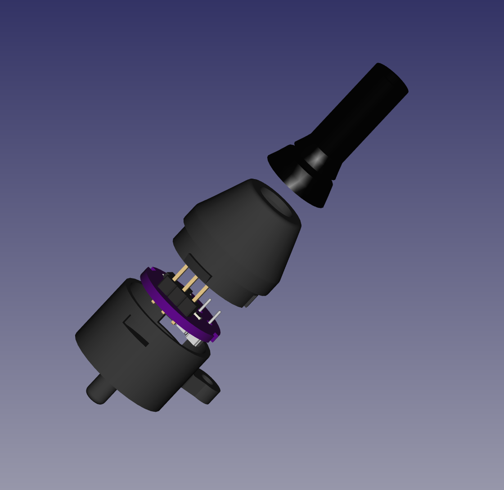
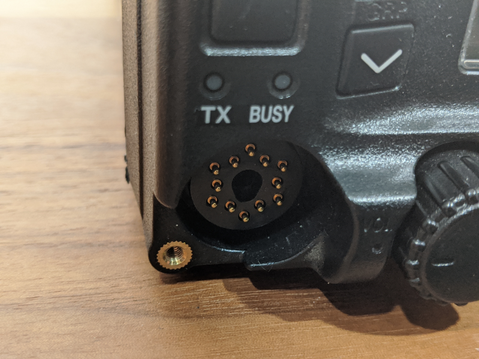
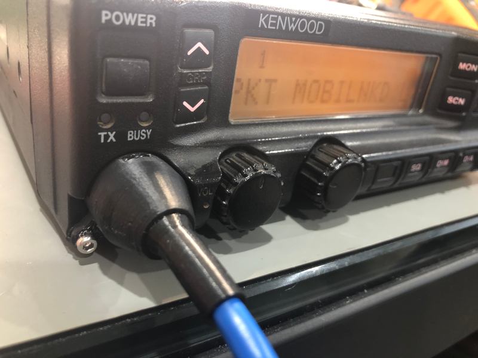

# Kenwood TK-x90 Programmer Models

This directory contains the FreeCAD model and STL files for the Kenwood
TK-x90 programmer connector.  This fits the Kenwood TK-690, TK-790 and
TK-890 radios.  It is intended to be used with the TK-x90 programmer
PCB in this repository.

<table>
  <tr>
    <td>  </td>
  </tr>
</table>

The boot is sized to fit around common CAT 5e Ethernet cable.

In addition to these components, you will need the PCB that is in this
repository and an M2.5x5mm screw (longer, up to 8mm is possible).

## License

These models are licensed under the [CC-BY-SA](http://creativecommons.org/licenses/by-sa/4.0/).

Please attribute the work to *Rob Riggs, WX9O, Mobilinkd LLC*.

## Build Recommendations

These models were originally built using a FlashForge Creator X, heavily
modified.  The modifications include full enclosure, Creator Pro Z stage,
all metal hot-ends, and optical Z end-stop.  The models were printed on a
borosilicate glass plate with silicone thermal pads.

These parts were sliced using [Simplify3D](https://www.simplify3d.com/).

You will need to account for material shrinkage that will occur as the
parts, especially the ABS, cool.

### Base and Shell

 * Material: ABS
 * Layer: 150um (0.15mm)
 * Nozzle: 0.40mm diameter
 * Supports: required
 * Adhesive: hair spray

### Boot

 * Material: NinjaTek NinjaFlex
 * Layer: 150um (0.15mm)
 * Nozzle: 0.40mm diameter
 * Supports: required
 * Adhesive: glue stick

This material is very strong.  It requires a sharp blade to remove the supports
between the base and overhang.

## Assembly

Remove all supports from the base, shell and boot.  The NinjaFlex
material is tough to cut.  I have used fine diagonal cutters to nibble
away the supports in the gap.

The boot needs to be inserted into the shell.  The gap on the boot is
intended to mate with the end of the shell.  It will require considerable
force to push the thickening boot wall through the end.  I used long
needle-nosed pliers to grip the boot and pull a little out at a time.

Slide the shell/boot assembly over the Ethernet cable.

Strip the wires and solder 3 wires of the Ethernet cable to the GND,
TX and RX serial port through-hole pads on the board.  *Please refer
to the PCB folder for detailed cable assembly instructions.*

Insert the PCB into the base, lining up the slots with the clips and the
two connector pins at the 7 & 8 o'clock position (neares the attachement
arm).  Press the board in place until it latches.

You may wish to connect the programmer to the radio and verify that it
is functioning properly before completing the assembly process beyond
this point.

Slide the boot assembly over the cable until it begins to mate with the
base.  Orient the shell so that the two cut-outs match the PCB clips
and the clips on the shell are aligned with the clip cut-outs on the base.

Push the shell into the base until the clips engage.  This will require
a bit of force and persistence because the ABS shell is a bit too thick
to give easily.

## Radio Connection

The radio uses a proprietary 12-pin connector.  It uses pogo pins in two
concentric rings of 6 pins, 12 & 9mm ⌀, offset by 30°.  We only need two
pins (at 7 & 8 o'clock, TRD & GND) for the programmer.

<table>
  <tr>
    <td>  </td>
    <td>  </td>
  </tr>
</table>

The radio must be powered off when connecting the programmer to the radio.

Connect the programmer to the radio, being careful to align the connector
attachement point with the screw hole.  Use the M2.5 screw to fasten the
programmer to the radio.

Plug the serial adapter into a USB connection.

Power on the radio.

Use the KPG-44D software to verify that it is functioning correctly.

## Further Work

After designing this, it occurred to me that the clips in the base are rather
flimsy and hard to print accurately.  They can be eliminated entirely if the
sleeve from the shell came down further to hold the PCB in place.  There is
enough clearance for that.

The inner sleeve would need to be extended 1.5-1.8mm and the clips re-oriented
to act as PCB & shell alignment guides.

