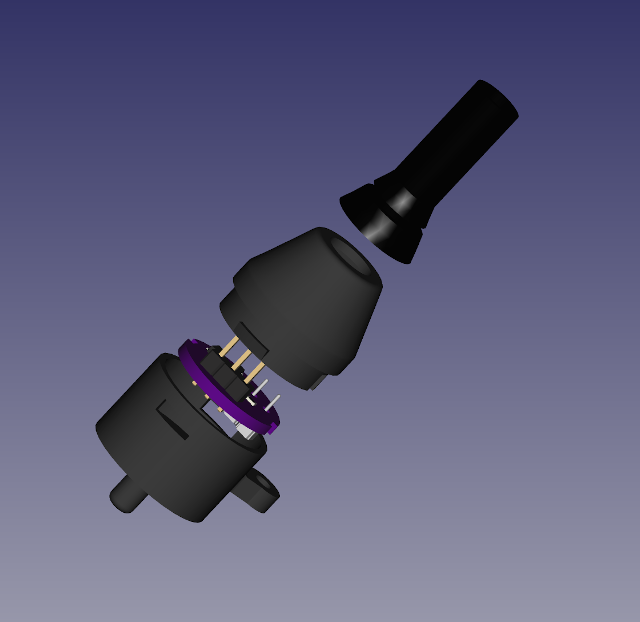
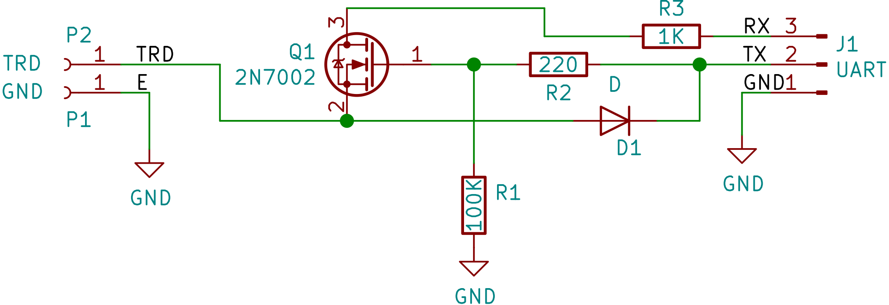
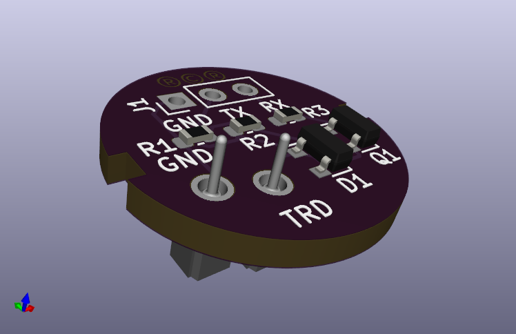

# Kenwood TK-x90 Programmer PCB

This directory contains the KiCad project for the Kenwood TK-x90 programmer.
This is designed to adapt a standard 5V capable USB to serial UART adapter
to the one-wire serial protocol used by the Kenwood TK-690, TK-790 and
TK-890 radios.  It is intended to be used with the TK-x90 programmer
connector in this repository.

<table>
  <tr>
    <td>  </td>
  </tr>
</table>

## License

This circuit design is licensed under the [CC-BY-SA](http://creativecommons.org/licenses/by-sa/4.0/).

Please attribute the work to *Rob Riggs, WX9O, Mobilinkd LLC*.

## Schematic

<table>
  <tr>
    <td>  </td>
  </tr>
</table>

## Theory of Operation

This circuit converts a standard 3-wire serial interface into a one-wire serial
interface, ensuring the data transmitted by the serial two-wire interface does
not see its TX data on the RX line (no local echo).

One side of the interface has GND, TX and RX.  The other side has GND and TRD
(transmit/receive data).  TRD is pulled high by the radio when powered on.

The input to the programmer is a standard 3-wire asynchronous serial connection
from a 5V capable USB to TTL serial adapter.  This is converted to a one-wire
serial protocol.  Unlike the one-wire implementation in Motorola radios, the
Kenwood protocol does not allow local echo of the transmitted data.

The serial RX line is pulled high and serial TX operates in push-pull mode. 

The N-channel MOSFET Q1 shuts off the RX connection when TX brings the line
LOW.  This leave RX high while the serial module transmits. TX pulls TRD low
via D1. TX operates as if in open drain mode.

When the radio is transmitting, TX is high, Q1 is conducting, allowing TRD to
pull RX high or low through Q1.  D1 prevents the TX line from interfering
the TRD data transmission.

It might be helpful to note that there is a 100Ω resistor on the TRD line in
the radio itself.

## BOM

<table>
  <tr>
    <td>  </td>
  </tr>
</table>

 1. 2x [MillMax 310-13-101-41-001000](https://www.digikey.com/product-detail/en/mill-max-manufacturing-corp/310-13-101-41-001000/ED7464-01-ND/265808)
 1. 1x [2N7002](https://www.digikey.com/product-detail/en/on-semiconductor/2N7002/2N7002NCT-ND/244664) SOT-23 N-Channel MOSFET
 1. 1x [MMBD4148](https://www.digikey.com/product-detail/en/diodes-incorporated/MMBD4148-7-F/MMBD4148-FDICT-ND/815711) SOT-23 General Purpose Diode
 1. 1x 100kΩ Resistor, 0603 (1608 Metric) package
 1. 1x 1kΩ Resistor, 0603 (1608 Metric) pacakge
 1. 1x 220Ω Resistor, 0603 (1608 Metric) pacakge
 1. 1x [USB to serial adapter](https://www.digikey.com/product-detail/en/seeed-technology-co-ltd/317990279/1597-1492-ND/7056809), 5V tolerant (not shown above).
 1. Lenth of CAT 5e Ethernet cable (any round, 5mm diameter Ethernet cable will do).
 1. Shink tubing that will fit over the Ethernet cable.  Otherwise electrical tape will work.

The MillMax parts are usually cheaper to order in longer strips.  They are
designed to fit IC leads, useful for making custom IC sockets.  Rather than
just buying two, consider buying one or more [strips of 64](https://www.digikey.com/products/en?keywords=310-13-164-41-001000).
If you intend to make the microphone adapter, you will need 8 more.

I used a CP2102-based board similar to the one linked above, but without the
pin headers attached.  I found these on eBay for about 5 for $10.

## Assembly

Mount the surface mount components on the PCB.  I used solder paste in a
syringe applied to the pads and reflowed the board in an oven.  But these
should be reasonable sized components to hand solder using a soldering
iron.  Space is constrained in the plug for this board so we
could not use larger parts or through-hold components.

Once the surface mount components are soldered in place, solder the pads
P1 and P2 in place on the botton of the board.  Keep the oriention as
close to the silkscreen orientation as possible.

## Cable Assembly

These assembly instruction assume that you have the [connector components](../programmer-connector/README.md)
completed and partially assembled.

 1. Cut an the Ethernet cable to the desired length.
 1. Cut off any RJ-45 connectors that are attached at either end.
 1. Cut back about 10-15mm of the outer insulation from one end.
 1. Find the blue/white, orange, and the orange/white wires.
 1. Strip about 3-4mm of insulation from these three wires.
 1. Trim the remaining wires back to the outer insulation, leaving just
    these three exposed.
 1. Slide the shrink tubing onto the cable.
 1. Solder the blue/white wire to GND on the USB/serial board.
 1. Solder the orange wire to the TX line of the USB/serial board.
 1. Solder the orange/white wire to the RX line of the USB/serial board.
 
One half of the cable is complete.  Verify that the shrink tubing is on
cable.  We won't heat the shrink tubing until we verify the cable works.
 
We now turn our attention to the other end of the cable and the  PCB
that was assembled above.  Note that when soldering the serial wires,
we are **not crossing the TX/RX wires**.
 
Before we begin, there may be burrs or other protrusions on the PCB from
manufacturing.  These need to be filed off smooth so that the PCB will fit
in the connector base.  Clean up the PCB and verify that it will in the
base, but do not push it in so far that it engages the clips.  The board
diameter should measure 17mm.  There is only 0.5mm clearance for the PCB
designed into the connector assembly.
 
 1. Slide the connector shell/boot assembly over the end of the cable.
 1. Cut back about 15mm of the outer insulation from the remaining end.
 1. Find the blue/white, orange, and the orange/white wires.
 1. Strip about 3-4mm of insulation from these three wires.
 1. Trim the remaining wires back to the outer insulation, leaving just
    these three exposed.
 1. Solder the blue/white wire to GND on the PCB.
 1. Solder the orange wire to the TX line of the PCB.
 1. Solder the orange/white wire to the RX line of PCB.

The cable ends have been soldered.  We are now going to mount the PCB
in the connector base and verify that the cable works.

 1. Orient the PCB so that the two MillMax sockets are near the screw
    attachement point of the base.
 1. Find the clips and align the slots on the PCB with the clips.
 1. Push the PCB into the base until the clips engage.
 
Now we need to test the programmer cable.  I recommend going through the
full read and write process with the Kenwood programming software.
Information on how to do that is outside the scope of this brief
document.

In a pinch we can just watch the traffic come through as the radio
boots up, testing reading only.  This is what we will do here.

A word of warning/advice.  Do not connect or disconnect the cable
with the radio on.  Do not power on the radio if the cable is connected
to the radio but not plugged in to a USB port.

 1. Ensure the radio is powered off.
 1. Connect the serial adapter to a computer.
 1. Connect the adapter to the radio, aligning the connector base with the
    PCB carefully and screwing in the connector to ensure that it is
    properly secured.
 1. Open a serial console (such as PuTTY or CuteCom)
 1. Set the serial parameters to 9600 baud, 8N1.
 1. Open the serial port.
 1. Turn on the radio.
 1. You should see a bunch of binary data flow into the terminal
 1. Turn the channel select knob on the radio.  You should see data being
    emitted for each click of the knob.

If this test failed, go back and verify all of the connections.  Verify
that the USB/Serial adapter did not reverse the TX/RX designation on the
adapter board.  (That has bitten me more than once.)

Assuming it passed, we need to finish the assembly.

 1. Turn the radio off.
 1. Disconnect the cable from the radio.
 1. Unplug the USB serial adapter.
 1. Use the shink tubing or electrical tape to protect the connection to
    the USB Serial adapter.
 1. Slide the connector boot assembly down towards the base.
 1. Orient the boot assembly so the cutouts line up with the clips holding
    the PCB in place.  This should also orient the clips on the shell with
    the cutouts on the base.
 1. Insert the shell into the base, pressing until the clips lock in place.
    This may require some force.

 
